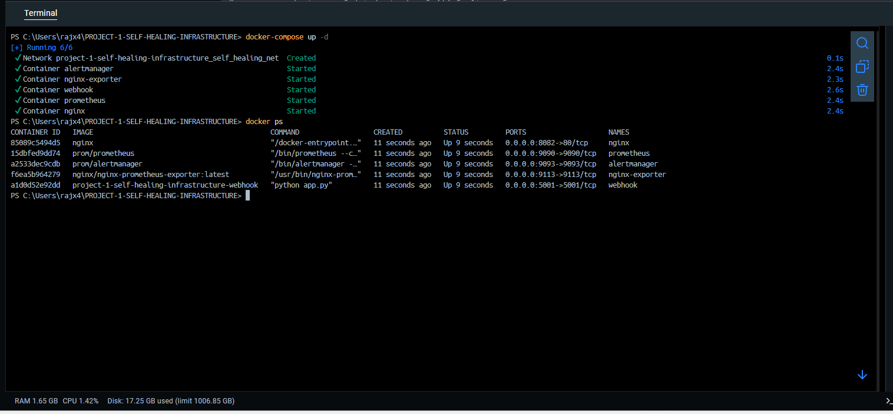

# Self Healing Infrastructure Using Prometheus, Alertmanager, Flask Webhook, Ansible, Docker

---

## Objective 

> To build an automated self-healing infrastructure where prometheus detects a failure, triggers an alert via Alertmanager, which then notifies a custom Flask webhook that restarts the failed container using Docker API. 

---

### Project structure 

```
.
├── screenshots
├── webhook/
│   ├── ansible.cfg
│   ├── app.py
│   ├── Dockerffile
│   ├── playbook.yml
│   └── alertmanager.yml
├── docker-compose.yml
├── nginx.conf
├── prometheus.yml
├── README.md
└── rules.yml

``` 
---

### Tech stack & Tools
- Prometheus - Monitoring
- Alertmanager - Alert routing
- Flask webhook - Custom container recovery
- Docker - Containerization
- Docker compose - Service orchestration
- Nginx - Test application
- Node Exporter/ Nginx Exporter - For detailed metrix 

---

### Workflow

1. **Prometheus** continuously monitor services (like Nginx).
2. If a container is down (up == 0 ), an alert is generated using **rules.yml**.
3. **Alertmanager** recieves the alert and sends a POST request to the **Flask Webhook**.
4. The **webhook** identifies the stopped container and restarts it using Docker SDK. 

---

### How to Run 

1. Clone the repo 

```
git clone https://github.com/WhereareyouRAJ/Final-Projects.git
cd PROJECT-1-SELF-HEALING-INFRASTRUCTURE

```
2. Start services 

``` 
docker-compose up --build -d 

```
3. Visit 
- Prometheus: http://localhost:9090 
- Alertmanager: http://localhost:9093
- Nginx: http://localhost:8082

### How to Test

- Manually stop the nginx container
```
docker stop nginx
```
- Prometheus will mark it as down and send alert->webhook -> container restarts automatically 

---

### All containers are running


### Prometheus, Alertmanager & Nginx UI


###   Alert Received by Alertmanager


###  Nginx Recovered Automatically


---

### Challenges Faced &  Resolutions

| **Challenges**| **Resolutions**|
|-------------|---------------|
| Docker network conflict | Used external Docker network with correct labels| 
| Alert not triggering | Fixed Prometheus scrape config and rules | 
| Webhook permission | Used ```user: root``` and mounted docker socket |
| Prometheus didn't reload rules | Ensured correct volume mapping & config syntax |

---
